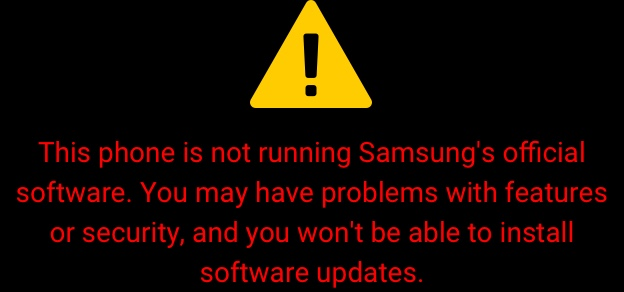

# Suppressing Bootloader Warnings on Samsung (Mediatek) Devices

To preface, the following information pertains to and is performed on our Galaxy A14 5G
The device runs the *MT6789* SoC, the Samsung *Helio G99* family are the following devices:

- Galaxy Tab A9 
- Galaxy Tab A9 WiFi
- Galaxy A15 5G
- Galaxy A16 5G
- Galaxy A24 5G

If you follow the steps below, I would *still* recommend verifying the location of the `up_param` partition. But overall, the [up_param](https://github.com/samsung-mt6789-dev/mtk_clean_boot/releases/tag/up_param) will be safe to flash to those devices.

---
**Identify the Bootloader "Logo" Partition**
-

Connect the device to your computer and open terminal or command prompt.

Enter an adb shell:

Access device shell with *elevated* priveleges

    Use 'su' for Magisk or 'kp' for KernelPatch/APatch

If Using Magisk, accept "SuperUser Request"

List the *block device* partitions

```shell-session
ls -al /dev/block/by-name
```
Look for the entry similar to `up_param -> /dev/block/sdxY`. This is the partition we're interested in

This is our entry:


**Backup the Original Partition**
To copy out the original `up_param` partition, run:
     

     ```
     dd if=/dev/block/sdc40 of=/sdcard/up_param.img
     ```
     
     
This will write a copy of the partition as a *tar* partition image named `up_param.img` in the root directory of our device Internal storage. **Backup this file** elsewhere if you mess with the image beyond repair.


The location is arbitrary, but move the file to your system. I would create a subdirectory in *Downloads/*

```plaintext
mkdir -p ~/Downloads/up_param && mv up_param.img ~/Downloads/up_param 
```


**Decompress and Edit the Images**
Decompress the `up_param.img` file to reveal a list of images 


```bash
tar xvf up_param.img 

```

The archive contents are decompressed in the *up_param/* directory

We want to edit the `booting_warning.jpg` and `svb_orange.jpg`
   


After testing it is safe to remove `booting_warning.jpg` entirely, without affecting the startup process and splash logos from booting
   
Since `svb_orange.jpg` is originally in 936x1800 aspect ratio, it doesn't match full screen resolution.


To fix the `svb_orange.jpg` from appearing "too small" upon boot, instead of having to modify the image itself you can just copy out the `logo.jpg` to rename and overwrite that to `svb_orange.jpg`

**Repack and Replace the Partition Image**
After editing, repack the modified images into back into a *tar* archive 


```bash
tar -cvf up_param.tar *.jpg 

```
Linux uses the `mv` command to rename, from `up_param.tar` to `up_param.img`


```bash
mv up_param.tar up_param.img

```

Place the modified `up_param.img` back into the `/sdcard` directory on your device. Where we first copied out the original `up_param.img`


**Restore the Modified Image**
Enter back into an *root* adb shell
- Write the modified image back to the original partition
 


```shell-session
dd if=/sdcard/up_param.img of=/dev/block/by-name/up_param
```
Reboot, and voila. 
